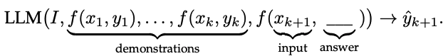
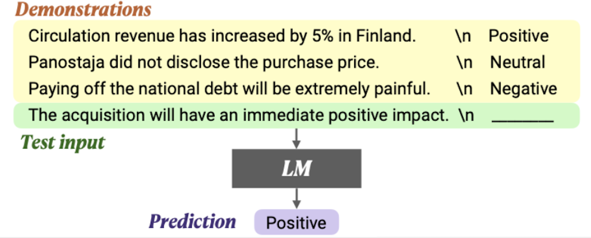
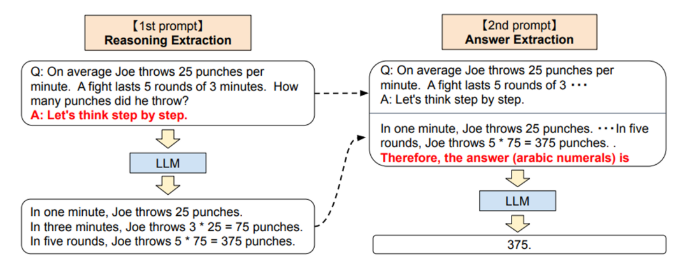

# 一.数据集
## 格式
### 1.Alpaca
**instruction（必填）**:优质指令。例如“总结以下文章”。  
**input（选填）**:任务的输入。例如一篇文章。  
**system**:系统提示词，包括模型的基本行为准则、个性特征和能力范围，由开发者设定。例如“你能够支持20万字的输入和输出”  
**output**:模型的输出。  
**history**:字符串二元组的列表,历史回答。  
```
[
  {
        "instruction": "人类指令（必填）",
        "input": "人类输入（选填）",
        "output": "模型回答（必填）",
        "system": "系统提示词（选填）",
        "history": [
          ["第一轮指令（选填）", "第一轮回答（选填）"],
          ["第二轮指令（选填）", "第二轮回答（选填）"]
        ]
  }
]
```  
### 2.ShareGPT
**Conversation**:对话对象列表，对象包含"from""value"。
**from**:发言者，可以是user,robot,**function_call**（工具tag）等。  
**value**:发言内容。  
**system**:系统提示词。  
**tools**:工具描述。  
```
[
  {
    "conversations": [
      {
        "from": "human",
        "value": "user instruction"
      },
      {
        "from": "gpt",
        "value": "model response"
      }, 
      ...
    ],
    "system": "system prompt (optional)",
    "tools": "tool description (optional)"
  }
]
```
## 超参数
**temperature**:温度越高，softmax越平滑，输出越丰富。  
**top-k**:从概率排名前k的词汇中选择。  
**top-p**:从概率和为p的词汇中选择。  
  
# 二.模型的应用开发范式
## Prompt工程
通过构造prompt（提示），直接调教大模型。
### 1.上下文学习(In-Context Learning)
提供一些理想输入和输出**f(x,y)**，**“临时抱佛脚”**，不会更新参数。

  
**Example:**  


### 2.思维链提示(Chain-of-Thought)  
#### Few-Shot-CoT
类似ICL,但示例不止给出答案，还给出具体的推理过程。  


#### Zero-Shot-CoT
在指令中添加一个（**Let's think it step by step**）的提示。  
包含两个单独的提示-补全过程，先产生一个思维链，再将思维链融入Prompt提取出答案（**Therefore,the answer is...**）。

# 三.模型微调
## 1.LoRA
**冻结预训练模型参数，调整新增的低秩矩阵AB。**
LoRA秩:低秩矩阵的维度。  
LoRA随机丢弃：随机dropout一些新的参数，防止过拟合。  
LoRA缩放系数：低秩矩阵对模型参数的影响程度。