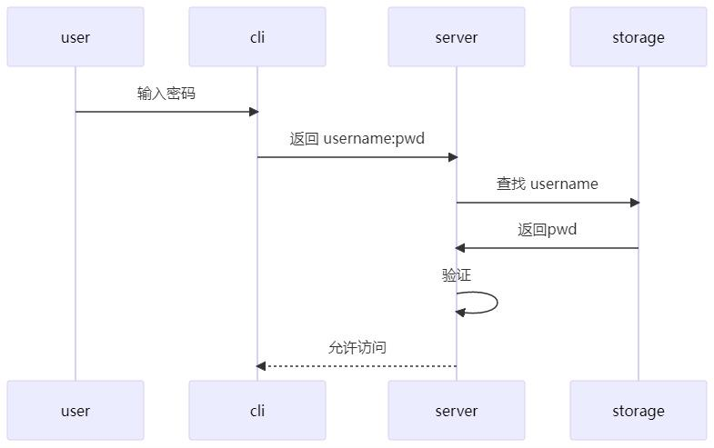
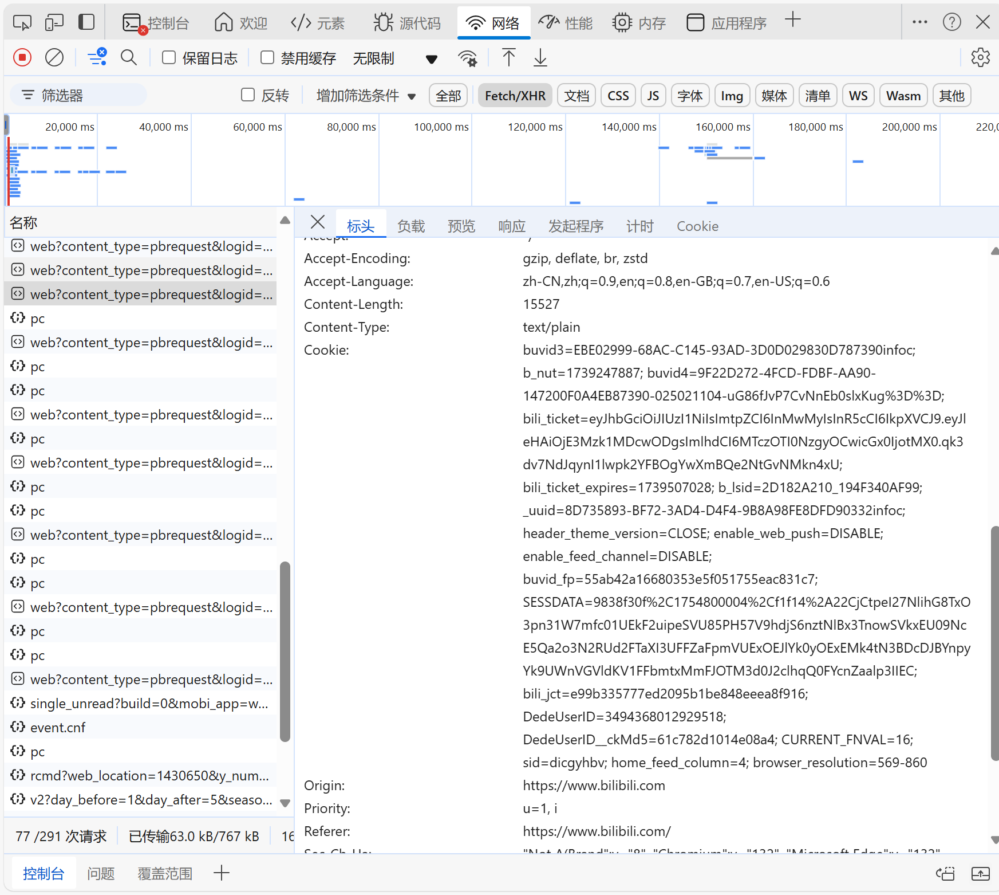
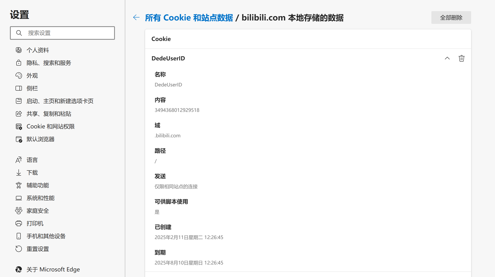
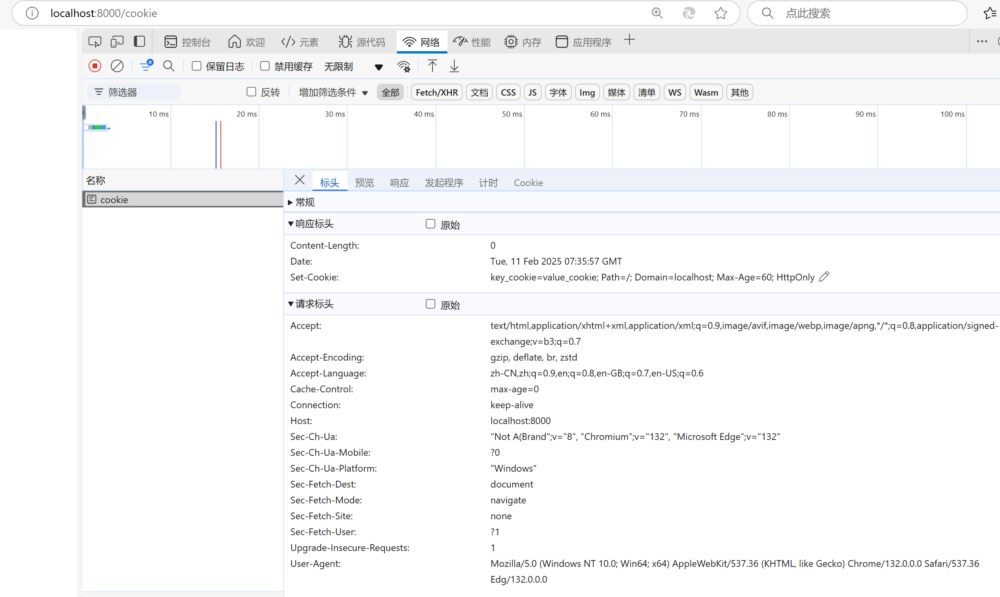
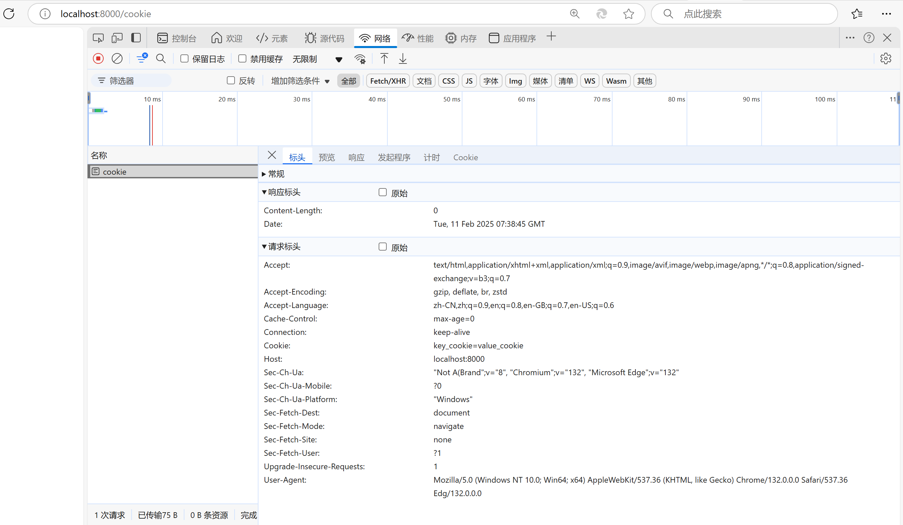

# 登录和鉴权
## strawman example
先让我们来看一种非常原始的登录流程：

user:用户
cli:客户端(注册或登陆界面)
server:服务端
storage:数据库

流程：
1.当我们第一次使用网站时，需要在注册或登录界面输入username和password
2.接着client会将username和password发送给server
3.然后server会查询数据库，检查用户名是否重复：
    (1)如果该用户名并不存在，则注册成功，username和password都会被存储到数据库中
    (2)但如果用户名重复，就要返回错误信息
4.当我们后续登录时，client同样会将我们输入的username和password发送给server，由server查询数据库，并进行验证

### 粗糙的代码实现
考虑到大家的学习进度，这里先使用接触较早的web三件套、golang和mysql来示范,它们分别对应上述的client、server和storage。
#### 1.client
```

```


### 上述登录流程的问题
1.首先是安全问题，直接传递密码可能会被人中途抓包，会造成信息泄露，暴露用户密码。
一种最朴素的解决方法是用非对称加密来传递密码，这样就算被截获了请求，对方还是不知道密码是什么。
但是问题并没有被完全解决，截获者可以不用破解密码，直接将原请求发给服务器，面对两份几乎一样的请求，服务器无法验证消息发送者的身份，只能作出相同的响应，这种攻击方式被称为 “中间人攻击”，
使用 HTTPS 协议时，因为可以确认发送者的身份，我们就能够防止中间人攻击了。实际上，如果使用了 HTTPS，我们基本上就不用担心什么传输过程中的安全问题了。

2.上述流程中，每次需要验证权限的操作，都需要向服务端传递密码。如果每次让用户手动输入，那体验想必是极差的，但是要把用户密码在客户端缓存，又会产生额外的安全问题。另外，虽然我们保证了传输过程是比较安全的，但是要是每次请求都带有密码，请求次数一但增多，谁能保证攻击者不从中分析出有用的信息呢。
解决此问题的方法是将权限验证分为两个过程，Login & Authentication。登录被单独拿出来作为一个单独的操作，用户需要传递密码或以其他方式证明身份来登录，登录后，其他的请求则不需要用户再传递密码。为此，我们需要一些机制，能够让网站知道用户已经登录过了，这就涉及到cookie等技术。

3.这个 strawman example 还有一些服务端的安全漏洞。攻击者虽然无法破解 HTTPS 的安全性，但是服务端自己的数据库却不一定是绝对安全的，攻击者有可能通过一些途径来获取到数据库内容。那么我们在数据库里直接储存用户密码就是很不安全的一件事情。
一般来说，我们存数据库时实际存的是加盐 hash 后的用户密码，每次验证时，将用户密码再按原来的方法 hash 一遍，对比验证。这样即使漏库了，也不太会泄露用户密码。
这样做还有一个好处，就是我们的数据库本身也不知道用户的实际密码。很多人有在不同应用使用同一个密码的习惯，所以他们可能不希望服务端知道他们的密码。有些密码管理器应用，甚至会在客户端传回密码前都要先进行一次加密，保证服务端从头到尾都不知道原密码是什么。

## Cookie
当我们首次登录B站时，服务器会创建一些信息并发送给浏览器，浏览器会对这些信息进行保存（按域名划分）。当我们后续访问该域名时，浏览器会自动把该域名下的信息与http请求一同发送给网站服务器，这样B站就知道我们已经登录过了。

这些信息就是Cookie，它们的大小有限，以kb为单位，以键值对的形式存储。

打开B站，如果你已经登录了，那么按F12打开开发者工具，切换到Network标签，刷新页面，随便点开某个fetch请求，我们基本能在请求标头中看到Cookie信息


可能在这里Cookie的内容不是很直观，那么打开浏览器的设置，我们同样可以看到浏览器保存了哪些网站的哪些Cookie，以及Cookie的内容。


看到底部的那个到期时间了吗？所以Cookie是有生命周期的,这样就不难理解我们隔段时间就要重新登陆一次。
## Session
但是有Cookie就够了吗？
一方面，Cookie的大小有限，如果需要记录的东西较多，那么显然应当由服务端来存储，比如用户的购物车、填写了一半的表单等。
另一方面，如果只有浏览器存储了信息，而服务端什么都不记录，那么服务器就无法确认请求者的身份，好比客人上门拜访，主人必须认得出对方是谁，更不能把小偷当成客人。所以我们需要在服务端存储一些信息，这就需要Session。

当我们访问网站时，服务器会创建一个Session,并把Session的ID发送给浏览器，浏览器会把它保存在本地，下次访问该网站时，会把它发送给服务器，服务器通过Session ID来识别用户，并查询该Session进行到哪了。

看得出来,Session是**基于Cookie**实现的

### 粗糙的代码实现
#### Cookie
对于客户端的请求，我们尝试通过.Cookie()方法获取Cookie,若请求标头中并没有携带Cookie，即首次访问，那么该方法会返回错误，此时我们通过.SetCookie()方法设置一个Cookie
```go
package main

import (
   "github.com/gin-gonic/gin"
   "fmt"
)

func main() {
   // 1.创建路由
   // 默认使用了2个中间件Logger(), Recovery()
   r := gin.Default()
   // 服务端要给客户端cookie
   r.GET("cookie", func(c *gin.Context) {
      
      cookie, err := c.Cookie("key_cookie")
      if err != nil {
         cookie = "NotSet"
         c.SetCookie("key_cookie", "value_cookie", 60, "/",
            "localhost", false, true)
        //参数分别表示Cookie的名称，值，过期时间，所在目录，所属域名，使用http还是https，是否允许别人通过js获取该cookie
      }
      fmt.Printf("cookie的值是： %s\n", cookie)
   })
   r.Run(":8000")
}
```
go run 该文件后，打开开发者模式，访问localhost:8000/cookie，可以看到由于是第一次访问,响应标头中有一条"set-Cookie"。

代码设置该Cookie在60秒过期,若在60秒内再次访问，可以看到请求标头中携带了一个Cookie.

#### Session
我们往往需要一个Session管理器来管理Session的创建和查询，这里可以使用第三方库github.com/gorilla/sessions，当然你也可以自己搓一个

下面是一个非常粗浅的例子，帮助大家感受下session大概是怎么工作的
```go
package main

import (
	"net/http"

	"github.com/gin-gonic/gin"
	"github.com/gorilla/sessions"
)

// 创建一个存储器，可以用.Get()方法来获取特定名字的Session,如果没有会自动创建
var store = sessions.NewCookieStore([]byte("Your-Secret-Key"))

func main() {
	r := gin.Default()
	//通过修改store.Options的MaxAge属性，可以设置Session的过期时间
	store.Options.MaxAge = 30
	//登录时，我们在存储中创建或查询特定的会话，并修改键值对
	r.GET("/login", func(c *gin.Context) {
		session, _ := store.Get(c.Request, "Your-Session-Name")
		session.Values["authenticated"] = true
		session.Values["username"] = "Username from your frontend"

		session.Save(c.Request, c.Writer)
		c.String(http.StatusOK, "Login success")
	})
	//当访问主页面时，需要确认Session中键值对是否符合预期
	r.GET("/home", func(c *gin.Context) {
		session, _ := store.Get(c.Request, "Your-Session-Name")
		if session.Values["authenticated"] == true {
			c.String(http.StatusOK, "Welcome "+session.Values["username"].(string))
		} else {
			c.String(http.StatusUnauthorized, "Please login first")
		}
	})
	//我们可以通过删除Session来实现注销
	r.GET("/logout", func(c *gin.Context) {
		session, _ := store.Get(c.Request, "Your-Session-Name")
		session.Options.MaxAge = -1 //设置MaxAge为负数，表示立即销毁Session
		session.Save(c.Request, c.Writer)
		c.String(http.StatusOK, "Logout success")
	})
	r.Run(":8000")
}
```
1.若直接访问localhost:8000/home,将会显示"Please login first"，因为我们还没有登录。

2.访问localhost:8000/login,登录成功，再次访问localhost:8000/home,将会显示"Welcome Username from your frontend"。

3.30秒后，再次访问localhost:8000/home,将会显示"Please login first"，因为Session已经过期。

4.访问localhost:8000/logout,会退出登录
#### Cookie的问题
CSRF(Cross-Site Request Forgery),即跨站请求伪造。
概括来说（可能不全面）:攻击者能通过一些方式诱骗user向目标网站发送请求，那么浏览器就会自动带上对应的Cookie.服务器一看"这Cookie和SessionID似乎都没问题啊"，就认为是合法的请求，然后同意了。
如何防御CSRF？
1.验证码
当网站接受到user的一些高危请求时，它可能会不太放心，要求user本人执行一些操作，不执行就拒绝请求。但是这会影响用户体验。

2.限制Cookie的携带
（这里需要了解一下Site和Origin）
站 Site 的概念一般由域名来区分。一般来说，域名服务商只售卖 xxx.xx 这样两层的 “二级域名”，再扩展的多级域名都属于二级域名的所有者。因此，我们将二级域名相同的网址称为 Same Site。
根据 MDN ，有时 site 的限定除了二级域名，还要求了协议。但是在我们之后的讨论范围内，site 都只限制二级域名，不限制协议。
源 Origin 的限制要严格的多，只有两个网址的 schema, host, port  全部相同，才能被称作同源。

如果我们假设 “同站” 的网站一般属于同一所有者，那么基本上同站之内不会发生上述攻击，并且可能期望共享 cookie。因此，浏览器对 cookie 做了一个 site 级别的限制。
SameSite 属性指定了限制的级别，有三个级别: strict|lax|none。
最严格的strict模式，任何跨站的 cookie 都不会被携带，意思是说，如果从 A.com 向 B.com 发送请求，不会携带任何 B.com 所属的 cookie。这样当然很安全，但是很不方便。例如，如果我们在文档里嵌入一个分享链接，那么用户点击这个链接跳转到相应网站时，不会携带任何 cookie。如果分享的是一个 github 链接，跳转过后用户会发现自己是未登录状态，必须重新刷新才能发送 cookie 然后刷新出登录信息。
因此，lax模式就是将一部分请求方式从限制中移除，其中就有\<a>标签，这样跳转链接这种请求就不会因为跨站而被限制 cookie。具体开放的请求方式，可以参考 这里。
none级别就是完全不进行 SameSite 限制。不过为了有最基本的安全保障，只有设置了 secure（只能通过 https 传输） 的 cookie 可以被设置为SameSite=none。（至于具体浏览器怎么处理没设置 secure 的请求就不一定了，比如 safari 会将这种 cookie 直接设置为strict）
SameSite 似乎正在从none改为lax，很可能不同浏览器的表现不一样。

3.限制请求
浏览器默认两个相同的源之间可以相互访问资源和操作 DOM 。但两个不同的源之间(跨域)若想要相互访问资源或者操作 DOM，那么会有一套基础的安全策略的制约，我们把这称为同源策略。
但是如果我们真的有跨域的需求怎么办？这就需要CORS(Cross-Origin Resource Sharing)，即跨域资源共享。
CORS 可以限定请求的来源和可以访问的资源，从而实现部分资源的跨域访问。
### Token
#### 我们为什么需要token?什么是token？
##### 性能
首先要提到的是**分布式系统**
互联网用户规模的扩大导致服务器的压力也越来越大，于是服务端往往会使用多台机器来分担请求。
设想，你的第一次请求可能由服务器A处理，服务器A因此存储了对应的Session。但是如果你的第二次请求由服务器B处理，这样服务器B也需要获取一份同样的Session,无论是时间效率还是空间效率都不太理想。
当然，我们可以把Session存储到数据库里，所有服务器都能访问，但是数据库的访问压力因此也会变大。
所以，我们希望通过一些方式缓解服务器的压力

Token就是一种解决方案
除此之外，token相比Cookie,长度可以更长，而且没有跨域限制.

以**JWT**(Json Web Token)为例
它由三部分组成，部分之间用.分隔
1.Header:声明用什么算法来生成签名
2.Payload:包含特定数据，例如有效期
3.signature:header和payload的编码结果，加上服务器存储的secret，它们三者通过header声明的算法得到的结果
可以在下方网站玩玩jwt的生成器
https://xn4zlkzg4p.feishu.cn/wiki/ClXcwC08hisd4Xk4VhCc1Mkmnqe#share-JxGJdlp5ioKnSzxSuJLcmldfnwb

用户首次登录时，服务器会生成一个JWT发送给用户，但它自己不保存。用户的后续请求都会带上这个JWT，服务器根据持有的secret验证JWT的合法性，然后从JWT中提取出用户的身份信息。
#### 粗糙的代码实现
```go

```