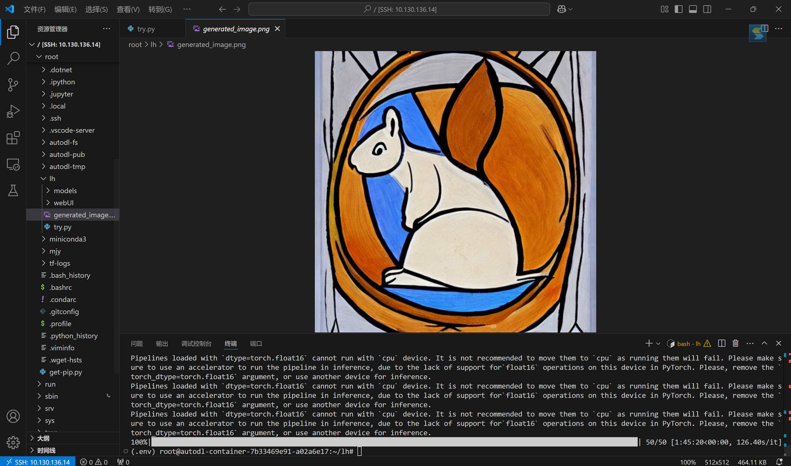

# Diffusion
## 搭建
1.安装transformers库
```bash
pip install transformers
```
2.创建虚拟环境
```bash
python -m venv .env  //创建虚拟环境
source .venv/bin/python  //激活虚拟环境
```
3.安装diffusers
```bash
pip install --upgrade diffusers[torch]
```
4.设置hf模型镜像(huggingface)
```bash
export HF_ENDPOINT=https://hf-mirror.com
```
5.尝试管道运行模型
```python
from diffusers import DiffusionPipeline
import torch

# 加载模型并指定使用 CPU
pipeline = DiffusionPipeline.from_pretrained("runwayml/stable-diffusion-v1-5", torch_dtype=torch.float16)

# 将模型移动到 CPU
pipeline.to("cpu")

# 生成图片
image = pipeline("An image of a squirrel in Picasso style").images[0]

# 保存图片到指定路径
image.save("generated_image.png")
```
结果如下


---

## 基本概念
### 基本的管道
包含一个 UNet2DModel 模型和一个 DDPMScheduler
#### 1.加载模型和调度器
```python
from diffusers import DDPMScheduler,UNet2DModel

scheduler=DDPMScheduler.from_pretrained("google/ddpm-cat-256")
model=UNet2DModel.from_pretrained("google/ddpm-cat-256",use_safetensors=True).to("cuda")
```
#### 2.设置去噪过程的时间步长数
```
scheduler.set_timesteps(50)
```
时间步长张量(根据步长创建的均匀间隔)
<details>
<summary>scheduler.timesteps</summary>
tensor([980, 960, 940, 920, 900, 880, 860, 840, 820, 800, 780, 760, 740, 720,
    700, 680, 660, 640, 620, 600, 580, 560, 540, 520, 500, 480, 460, 440,
    420, 400, 380, 360, 340, 320, 300, 280, 260, 240, 220, 200, 180, 160,
    140, 120, 100,  80,  60,  40,  20,   0])
</details>

#### 3.创建随机噪声
```python
import torch

sample_size=model.config.sample_size
noise=torch.randn((1,3,sample_size,sample_size),device="cuda")
```
#### 4.遍历时间不长
```python
input = noise

for t in scheduler.timesteps:
    with torch.no_grad():
        noisy_residual = model(input, t).sample  //生成噪声残差
    previous_noisy_sample = scheduler.step(noisy_residual, t, input).prev_sample  //step()方法获取噪声残差、时间不长和输入，预测输出
    input = previous_noisy_sample  //输出作为下一次输入
```
#### 5.去噪后的输出转换为图像
```python
from PIL import Image
import numpy as np

image = (input / 2 + 0.5).clamp(0, 1).squeeze()
image = (image.permute(1, 2, 0) * 255).round().to(torch.uint8).cpu().numpy()
image = Image.fromarray(image)
image
```
### 相对复杂的管道(文本到图像)
需要encoder来升维降维，tokenzier和encoder来生成文本嵌入
#### 1.加载模型
```python
from PIL import Image
import torch
from transformers import CLIPTextModel, CLIPTokenizer
from diffusers import AutoencoderKL, UNet2DConditionModel, UniPCMultistepScheduler  //取代PNDMScheduler

vae = AutoencoderKL.from_pretrained("CompVis/stable-diffusion-v1-4", subfolder="vae", use_safetensors=True)
tokenizer = CLIPTokenizer.from_pretrained("CompVis/stable-diffusion-v1-4", subfolder="tokenizer")
text_encoder = CLIPTextModel.from_pretrained(
    "CompVis/stable-diffusion-v1-4", subfolder="text_encoder", use_safetensors=True
)
unet = UNet2DConditionModel.from_pretrained(
    "CompVis/stable-diffusion-v1-4", subfolder="unet", use_safetensors=True
)
scheduler = UniPCMultistepScheduler.from_pretrained("CompVis/stable-diffusion-v1-4", subfolder="scheduler")
```
#### 2.使用GPU
```python
torch_device = "cuda"
vae.to(torch_device)
text_encoder.to(torch_device)
unet.to(torch_device)
```
#### 3.生成文本嵌入
```python
prompt = ["a photograph of an astronaut riding a horse"]
height = 512  # default height of Stable Diffusion
width = 512  # default width of Stable Diffusion
num_inference_steps = 25  # Number of denoising steps
guidance_scale = 7.5  # Scale for classifier-free guidance
generator = torch.manual_seed(0)  # Seed generator to create the initial latent noise
batch_size = len(prompt)

text_input = tokenizer(
    prompt, padding="max_length", max_length=tokenizer.model_max_length, truncation=True, return_tensors="pt"
)

with torch.no_grad():
    text_embeddings = text_encoder(text_input.input_ids.to(torch_device))[0]

max_length = text_input.input_ids.shape[-1]
uncond_input = tokenizer([""] * batch_size, padding="max_length", max_length=max_length, return_tensors="pt")
uncond_embeddings = text_encoder(uncond_input.input_ids.to(torch_device))[0]

text_embeddings = torch.cat([uncond_embeddings, text_embeddings])
```
#### 4.生成初始噪声
```python
latents = torch.randn(
    (batch_size, unet.config.in_channels, height // 8, width // 8),
    generator=generator,
    device=torch_device,
)
```
#### 5.scaling噪声
```python
latents = latents * scheduler.init_noise_sigma

from tqdm.auto import tqdm

scheduler.set_timesteps(num_inference_steps)

for t in tqdm(scheduler.timesteps):
    # expand the latents if we are doing classifier-free guidance to avoid doing two forward passes.
    latent_model_input = torch.cat([latents] * 2)

    latent_model_input = scheduler.scale_model_input(latent_model_input, timestep=t)

    # predict the noise residual
    with torch.no_grad():
        noise_pred = unet(latent_model_input, t, encoder_hidden_states=text_embeddings).sample

    # perform guidance
    noise_pred_uncond, noise_pred_text = noise_pred.chunk(2)
    noise_pred = noise_pred_uncond + guidance_scale * (noise_pred_text - noise_pred_uncond)

    # compute the previous noisy sample x_t -> x_t-1
    latents = scheduler.step(noise_pred, t, latents).prev_sample
```
#### 6.生成图像
```python
latents = 1 / 0.18215 * latents
with torch.no_grad():
    image = vae.decode(latents).sample

image = (image / 2 + 0.5).clamp(0, 1).squeeze()
image = (image.permute(1, 2, 0) * 255).to(torch.uint8).cpu().numpy()
image = Image.fromarray(image)
image
```
## 微调
### 1.加载数据集
```python
from datasets import load_dataset

config.dataset_name = "huggan/smithsonian_butterflies_subset"
dataset = load_dataset(config.dataset_name, split="train")
```
### 2.处理数据集
```python
from torchvision import transforms

preprocess = transforms.Compose(
    [
        transforms.Resize((config.image_size, config.image_size)),
        transforms.RandomHorizontalFlip(),
        transforms.ToTensor(),
        transforms.Normalize([0.5], [0.5]),
    ]
)

def transform(examples):
    images = [preprocess(image.convert("RGB")) for image in examples["image"]]
    return {"images": images}


dataset.set_transform(transform)
```
### 3.DataLoader
```python
import torch

train_dataloader = torch.utils.data.DataLoader(dataset, batch_size=config.train_batch_size, shuffle=True)
```
### 4.创建UNet2DModel
```python
from diffusers import UNet2DModel

model = UNet2DModel(
    sample_size=config.image_size,  # the target image resolution
    in_channels=3,  # the number of input channels, 3 for RGB images
    out_channels=3,  # the number of output channels
    ...
)
```
### 5.添加噪声
```python
import torch
from PIL import Image
from diffusers import DDPMScheduler

noise_scheduler = DDPMScheduler(num_train_timesteps=1000)
noise = torch.randn(sample_image.shape)
timesteps = torch.LongTensor([50])
noisy_image = noise_scheduler.add_noise(sample_image, noise, timesteps)

Image.fromarray(((noisy_image.permute(0, 2, 3, 1) + 1.0) * 127.5).type(torch.uint8).numpy()[0])
```
### 6.计算损失
```python
import torch.nn.functional as F

noise_pred = model(noisy_image, timesteps).sample
loss = F.mse_loss(noise_pred, noise)
```

### 7.训练模型
from diffusers.optimization import get_cosine_schedule_with_warmup

optimizer = torch.optim.AdamW(model.parameters(), lr=config.learning_rate)
lr_scheduler = get_cosine_schedule_with_warmup(
    optimizer=optimizer,
    num_warmup_steps=config.lr_warmup_steps,
    num_training_steps=(len(train_dataloader) * config.num_epochs),
)