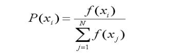

# Genetic Algorithm
一种通过模拟自然进化过程搜索最优解的方法
## individual & population
population(种群):个体的集合
individual(个体):包含了一组目标参数params和一个评分rating(用于表示适应度)

可以给__init__方法一个参数范围，接着随机初始化出每个个体的params
同时给予一个初始的rating

## generation
generation(代):population的迭代
以特定方式从种群中选出父代，经过交叉和变异产生子代(下一代种群)

父代的选择
1.锦标赛选择tournament selection：选出若干个体，rating最高的个体

2.轮盘赌选择roulette wheel selection：每个个体被选为父代的概率为其rating除以所有个体的rating之和

3.精英选择 elite selection：将一部分优秀个体直接保留到下一代种群

4.混合选择：将上述选择方法的结果按比例混合，产生新的种群

...
## crossover & mutation
crossover(交叉)：将两个父代的params进行交换，产生新的子代
mutation(变异)：随机扰动个体的params