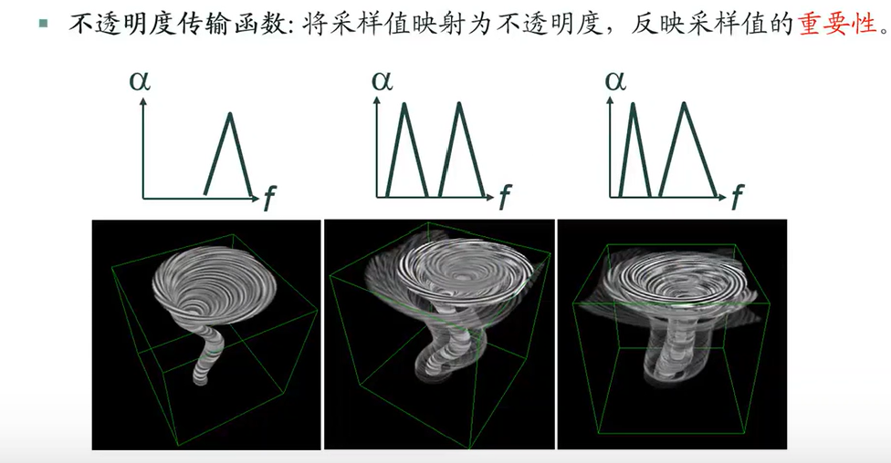
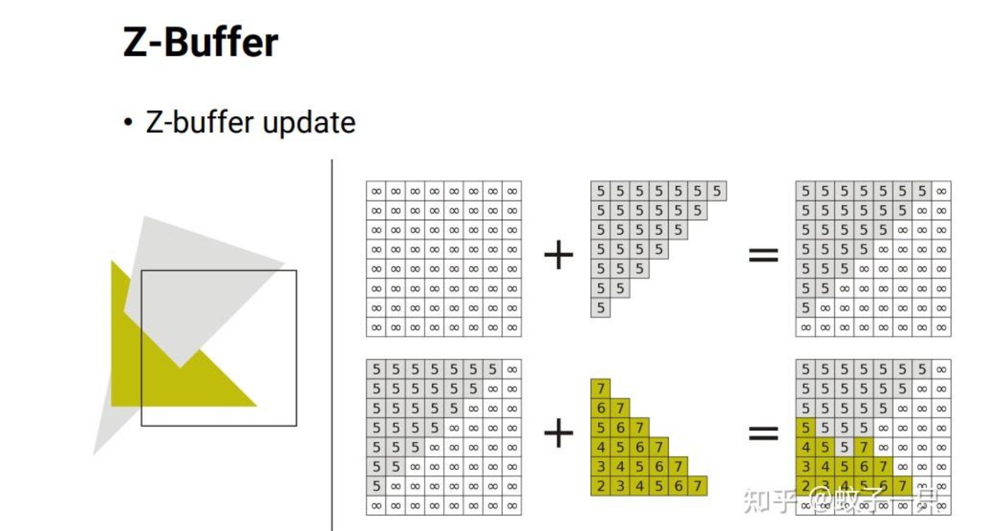

# 体绘制
# 光线投射算法
## Opical Models(光学模型)
一般采用**吸收和发射模型**：体素本身发射光线，并且可以吸收光线，但不对光线进行反射和透射
## 射线等间隔采样
```
D(i)=D(start)+d*(i*delta)
//D(i)表示第i个采样点的位置,d表示方向,delta表示间隔
```
每个采样点位于一个体素（八个顶点）内，通过三线性插值计算出该点的采样值

## 图像属性映射
将单个采样点的采样值 
传输函数：将采样值映射为图像属性的映射规则
基本原则：突出重点采样值区间（不透明），弱化不重要部分（透明）
本质：体数据的分类
### 颜色传输函数

### 透明度传输函数

## 不透明度(理解为权重)
从视点出发，光线会穿越多个物体  
alpha混合技术:将透明物体的颜色和其后物体的颜色进行混合
1.只有一种透明度时
```
目标颜色=透明物体透明度*透明物体颜色+(1-透明物体透明度)*后物体颜色
```
2.有多种透明度时（从前往后累计）
```
T(i)=T(i-1)+(1-T(i-1))*A(i)
//T(i)表示前i个物体的总不透明度，A(i)表示第i个物体的不透明度

C(i)=C（i-1）+(1-T(i-1))*D(i)
//C(i)表示前i个物体的总颜色，D(i)表示第i个物体的颜色
```
但是GPU不擅长计算线与面的交点，所以采用深度值的方法确认点与点的顺序问题
## 深度纹理
1.离视点越远，深度值越大

2.通过最大深度值的深度纹理减去最小深度值的深度纹理，得到"距离纹理"