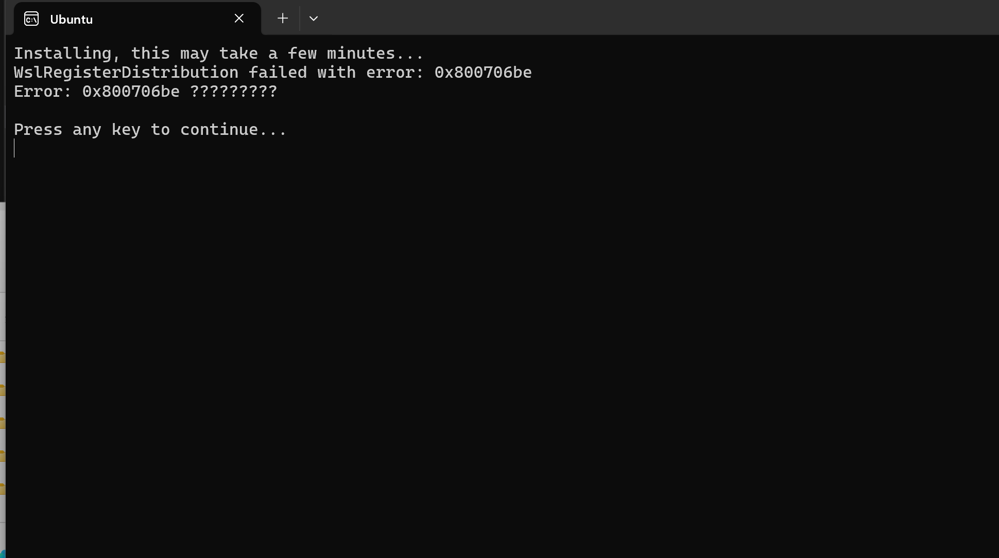
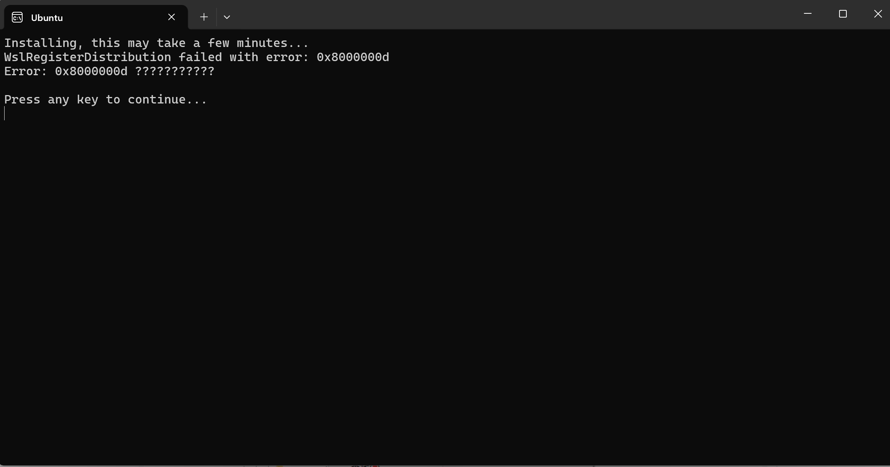
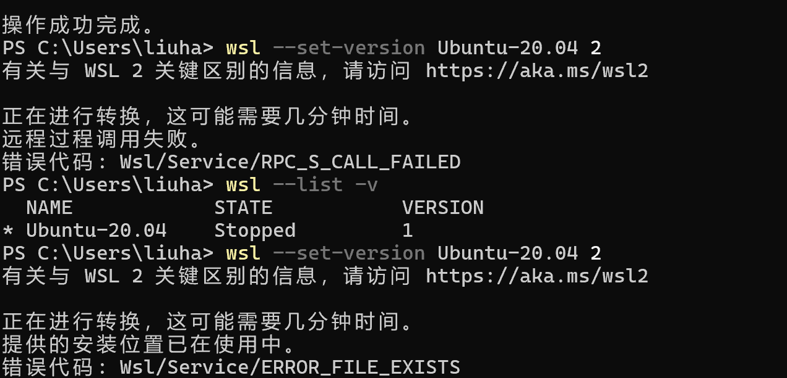

电脑为win11家庭版
问题
1.使用微软商店下载，最开始报错为800706be，重新尝试报错为8000000d


2.将默认版本设为1，可以安装成功，但无法升级

已尝试方法  
1.检查了"功能"中的虚拟机平台、linux子系统,hyperV(最初我的电脑并没有hyperV选项，使用网传方法安装重启后出现)  
2.卸载了VMware(据说可能存在部分不兼容，最后证实似乎与它无关)  
3.用管理员权限打开powershell,执行下面的命令
```
Enable-WindowsOptionalFeature -Online -FeatureName Microsoft-Windows-Subsystem-Linux
```
4.手动下载安装包解压安装,报错同问题1  
5.unregister卸载msl重新下载，无果
6.确保了wsl2linux内核的更新

7.在bios中确认enable了虚拟化
8.虽然windows系统已经更新到最新版本(它是这么显示的)，但还是强行更新了一次，重启后正常安装了